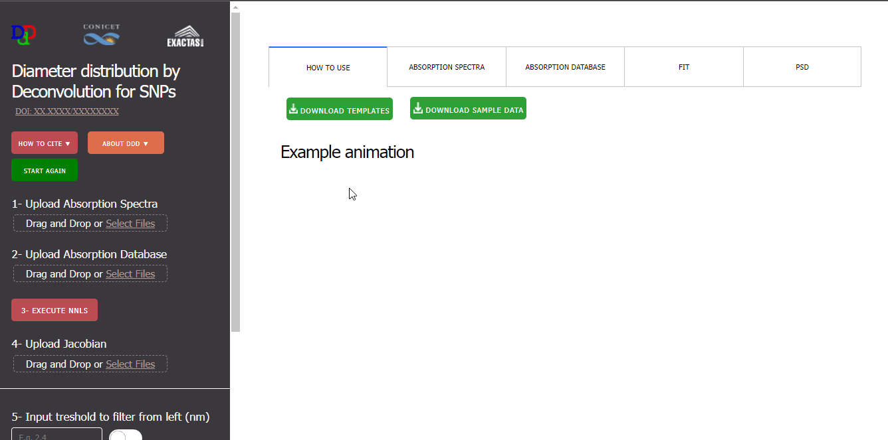

# Diameter distribution by Deconvolution (DdD) - WebApp 2.0
A Python (Dash by Plotly) Web Application to determine the Particle Size Distribution (PSD) of Semiconductor Nanoparticles (SNPs), using deconvolution.  

# Statement of Need
This WebApp is aimed at people in research and development that frequently works with SNPs. As of today, most of the routine characterization is centered in size determination and is strongly limited for the access to advanced equipment.  
Diameter distribution by Deconvolution (DdD) was created to assist anyone who has few access to expensive characterization techniques, making it possible to help researchers with a small budget for working in this field.  
We believe that this graphical user interface is intuitive for everyone, besides that it does not require the user to know any programming language or the analytical methods used in the WebApp.  

# Installation instructions
If you don't want to install it, you can use the application online at https://determinenpssizes.herokuapp.com/  
1. To run the WebApp in your machine you need Python 3.9 installed. Download it from [python.org](https://www.python.org/downloads/) (we suggest adding it to PATH when asked in the installation).
2. Go to https://github.com/danisuar3z/ddd-2 and clone the repository (`git clone <github_url>`) or download as a ZIP (clicking in the Code button) and extract it.
3. Install the necessary libraries and dependencies listed in the requirements.txt file using pip (`pip install -r requirements.txt`). We suggest using a virtual environment.
4. In the terminal, make sure you are in the app directory and run the script named app.py (“py app.py”), and a server should be hosted on your machine. You can access it in your browser with the url provided in the terminal.

# Example of usage

# Acknowledgments
