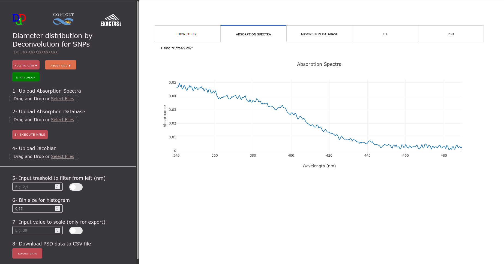
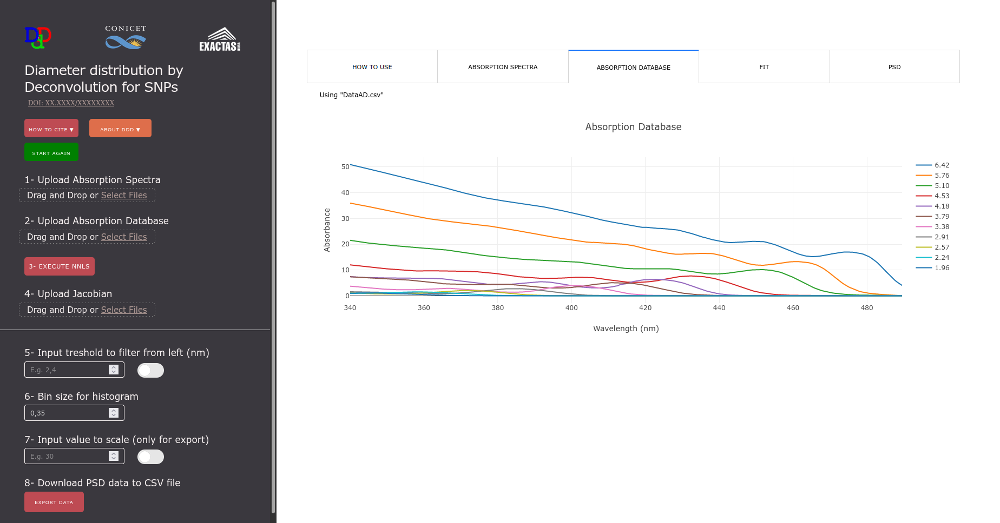
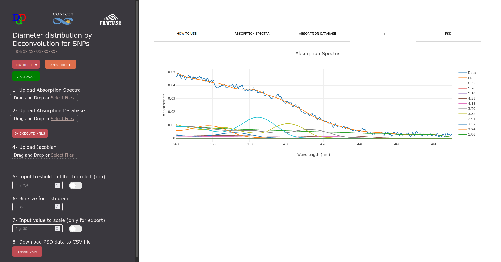
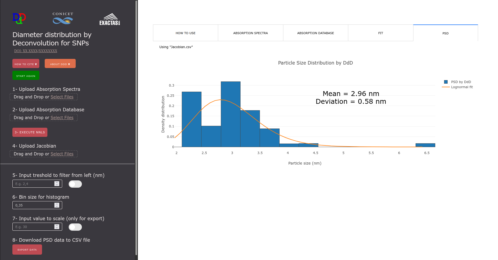
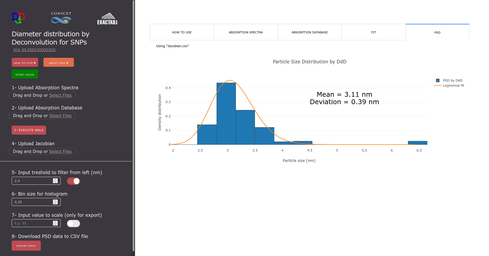

# Summary

Particles with a diameter below 500nm are generating an increasing interest due to their applications in industry and research. In particular, semiconductor nanoparticles (SNPs) have applications in several fields such as catalysis, energy harvesting, light emission, and sensors [@kovalenko2015prospects]. These applications rely on their properties which are determined by SNPs size, then the size characterization is essential for these applications [@onna2022loading]. A usual way to represent the size is the Particle Size Distribution (PSD - e.g., histogram of sizes), which typically can be obtained by using electron microscopies. These methods look directly at the sample with an electron beam and measure and count the particles, but they are expensive in terms of money and time. Therefore, alternative methods, such as optical methods for size determination, are interesting approaches to a faster and cheaper characterization.
In this work, we present a WebApp that processes absorbance measurements from a spectrophotometer to obtain the PSD. Applying deconvolution to an absorbance spectrum of the sample (using a database with different sizes’ absorbance spectra), the goal can be achieved with excellent accuracy [@onna2019diameter]. The app lets you upload your data, calculate and view the PSD, and export the result.

# Statement of Need

This WebApp is aimed at people in research and development that frequently work with SNPs. Typically, a routine characterization consists in determining the size distribution of a new SNPs obtained sample. This task is frequently limited due to de access to advanced equipment.
Diameter distribution by Deconvolution (DdD) was created to assist anyone who has restricted access to expensive characterization techniques, making it possible to help researchers with a small budget for working in this field. It can also be useful for education purposes where advanced techniques are generally not available.
We believe that this graphical user interface is intuitive for everyone since it does not require the user to know any programming language or any of the analytical methods used in the WebApp.

# Usage

A more specific explanation of its applications can be found in [@onna2019diameter], including why a Jacobian is used.

1. Upload your sample absorbance spectrum file in the respective upload box. The file must follow the structure provided in the template file (data/template_AS.csv). You should see the spectrum plotted in the “ABSORPTION SPECTRA” tab as shown in \autoref{fig1}.

{ width=60% }

2. Upload your absorption database spectra file in the respective upload box. The file must follow the structure provided in the template file (data/template_AD.csv). You should see the spectra plotted in the “ABSORPTION DATABASE” tab as shown in \autoref{fig2}.

{ width=60% }

3. Click the EXECUTE NNLS (Non-Negative Least Squares) button. You should now see both sample, database and the NNLS adjusted spectra plotted in the “FIT” tab as shown in \autoref{fig3}.

{ width=60% }

4. Upload your jacobian file in the respective upload box. The file must follow the structure provided in the template file (data/template_Jac.csv). You should now see the PSD plotted in the “PSD” tab as shown in \autoref{fig4}.

{ width=60% }

Optional

5. You can select a threshold value to filter the smaller sizes. As mentioned in the paper [@onna2019diameter], the numerical error is in the smallest elements of the fitting. The PSD graph should update automatically as shown in \autoref{fig5}. Have in mind that depending on your system language, the input box may or may not accept dot or comma as the decimal separator.

{ width=60% }

6. You can select a value to scale the resulting PSD to have it in the units you prefer. Potentially you could use an EDS measure of the sample and scale it.
7. You can export the PSD data to a CSV file. The exported data accounts for the filter value you used.

# Acknowledgements

This work was supported by Universidad de Buenos Aires (UBACyT 20020190200245BA & 20020190100299BA). D. O., S. A. B. and M. L. M. R are members of CONICET. 
 
# References
